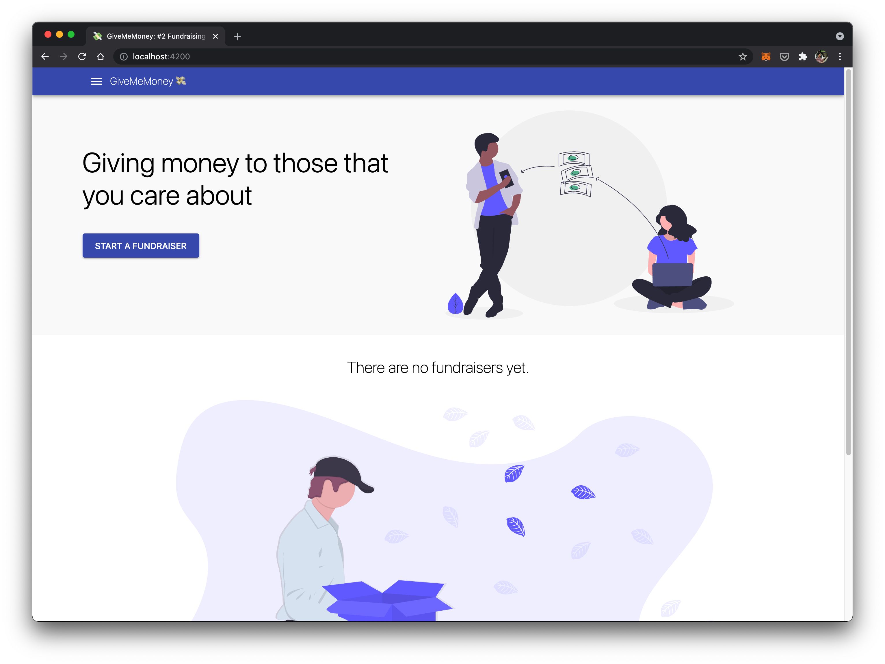
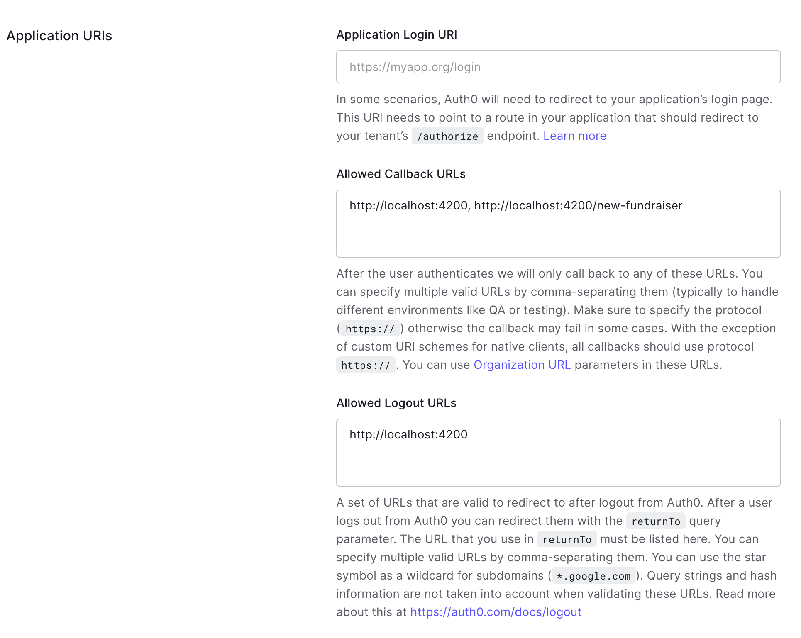

# SendMeMoney

SendMeMoney is a demo fundraiser service similar to GoFundMe. It consists of three apps:

1. Browser app using [React](https://reactjs.org/)
2. Mobile app using [React Native](https://reactnative.dev/)
3. Backend (API) app using [NestJS](https://nestjs.com/) and [MongoDB](https://www.mongodb.com/)

The workspace is created with [Nx](https://nx.dev), and all apps are run and built with Nx as well.

⚠️ WARNING - These apps are not production ready. The donations are all fake, and SendMeMoney does not use a payment service behind the scene. There is no authorization/permissions built into the Backend.

## Showcase

**Browser App**

The browser app allows users to view fundraisers, as wel as create new ones (if they are logged in). Authentication is handled using Auth0.



**Mobile App**

The mobile app is limited in features, and users are only able to view and donate to existing fundraisers.


## Architecture

The three apps are in the `apps` folder:

1. Web - `apps/web-app`
2. Mobile - `apps/mobile-app`
3. Backend - `apps/backend-app`

These apps are thin shells around feature libs (pages for web, screens for mobile, and API for backend).

Additionally, there are shared libs that are used by both web and mobile apps.

- `libs/data-access-api` -- React hooks for make API calls
- `libs/shared-contexts/api-context` -- React context provider and hooks for setting and getting API settings
- `libs/shared-hooks/use-boolean` -- React hook for toggles
- `libs/shared-formatters/currency` -- functions for formatting currency (could be used in Node as well)

As well as shared interface libs used by all three apps.

- `libs/shared-models/donation`
- `libs/shared-models/fundraiser`

Use `npx nx dep-graph` to see the full project graph.


## Prerequisites

There are two prerequisites: **Docker** and **Auth0**.

Make sure you have [Docker](https://www.docker.com/) installed and running on your machine. This is needed to run the Mongo database for the backend.

You also need an account with [Auth0](https://auth0.com/), and a new Auth0 app to use with SendMeMoney.

In your Auth0 app settings, use the following setting in the _Application URLs section_.

**Allowed Callback URLs:**

```
http://localhost:4200, http://localhost:4200/new-fundraiser
```

**Allowed Logout URLs:**

```
http://localhost:4200
```

Your settings should look like this.



Make sure to save!

## Getting Started

First, clone the repo.

```bash
git clone https://github.com/jaysoo/sendmemoney.git
cd sendmemoney
```

Next, copy the `.env.example` file to `.env`

```bash
cp .env.example .env
```

Update the `.env` file with your Auth0 app info. It should look something like this.

```
NX_AUTH0_CLIENT_DOMAIN=someone.auth0.com
NX_AUTH0_CLIENT_ID=99999999999999999999999999999999
NX_AUTH0_CLIENT_SECRET=0000000000000__777777777_AAAAAAAAAAAAAAAAAAAAAAAAAAAAAAA_BBBB

# This is relative to the workspace root
NX_UPLOAD_DIRECTORY=tmp/uploads

NX_BACKEND_PORT=3333
NX_MONGO_HOST=localhost
NX_MONGO_DATABASE=sendmemoney

```

Next, install dependencies.

```bash
npm install
```

Lastly, start the MongoDB container.

```bash
npx nx mongo-start backend-app
```

**Note:** The command above can be found in `workspace.json` under `"backend"` project. It pulls the latest MongoDB image and starts the container.

## Running Apps Locally

Nx `serve` command is used to run the Backend and Web apps.

```bash
npx nx serve backend-app
npx nx serve web-app

# Or you can run them in parallel with run-many
npx nx run-many --target serve --projects backend-app,web-app --parallel
```

Your browser should open a new tab for the running web app (http://localhost:4200).

For the Native app, you need to use `run-ios` or `run-android` depending on the platform you want to run in.

```bash
npx nx run-ios native-app
npx nx run-android native-app
```

## Testing and Linting

To run all the unit tests use:

```bash
npm run test
npm run lint
```

It will take about 30-60 seconds test and lint. Subsequent runs will be much faster due to Nx's task cache feature. Nx will only re-run tests for projects that have been updated.

## Next Steps

There are a few more things to try in this workspace.

1. Wire up Stripe payments for a fuller experience. You can use the test `4242 4242 4242 4242` card number to test.
2. Allow users to authenticate in mobile app to create and view their fundraisers.
3. Wire up e2e tests for web and mobile. This isn't done currently.
